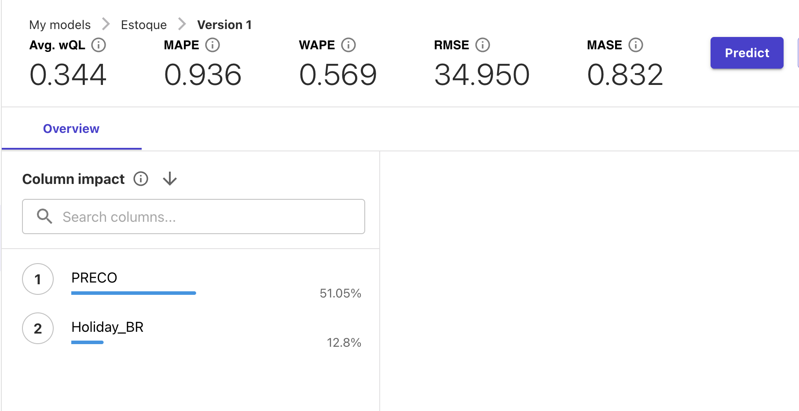
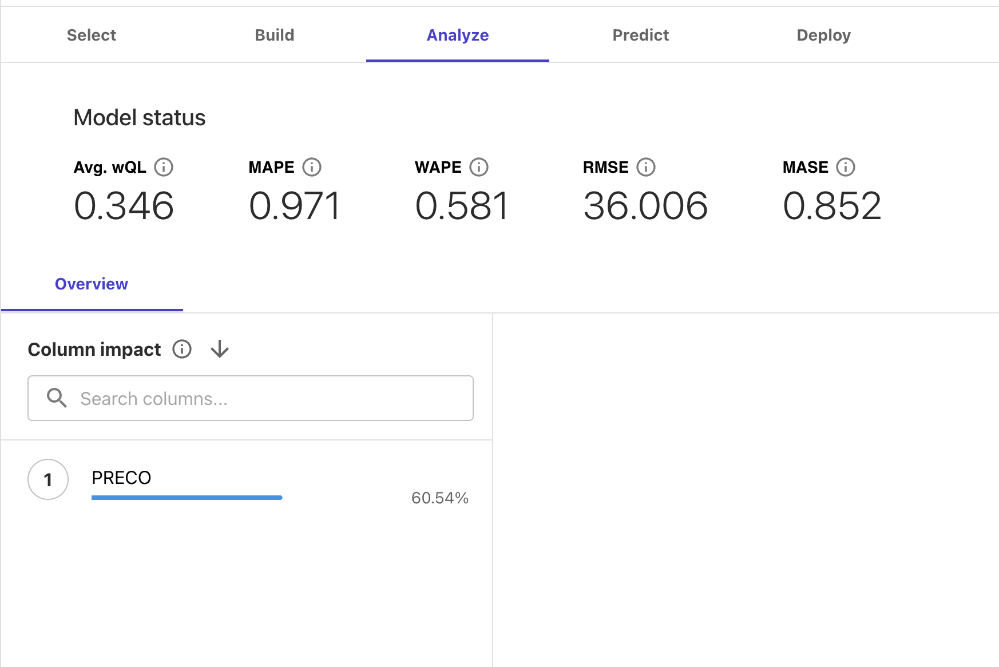

# 📊 Previsão de Estoque Inteligente na AWS com [SageMaker Canvas](https://aws.amazon.com/pt/sagemaker/canvas/)

Neste projeto de conclusão do Bootcamp de Machine Learning Na AWS, foi realizado a previsão de estoque sobre um dataset de 1000 registros, onde os itens apresentavam reposição de estoque e variação de preço. Um modelo fortemente ligado à realidade do comercio atacadista e varejista. 

## 🎯 Objetivos Deste Desafio de Projeto (Lab)

Aplicar as habilidades obtidas no Bootcamp e a partir do aprendizado de maquina de um determinado dataset, gerar um modelo de previsão de estoque.

## 📈 Resultados do Desafio

Foi realizado um treinamento satisfatório rápido, 15 minutos. O modelo gerado destacou fortemente a relação da variável preço frente ao volume de vendas, ou pressão sobre o estoque. Além disso, remarca que feriados também representam um aumento de vendas. No entando, um segundo modelo rapido foi gerado desconsiderando feriados do Brasil. Neste ultimo, é notavel que o preço passa a exercer 60% de pressão sobre o estoque frente aos 51% quando se considerava feriados.

### Resultado: Modelo de previsão de estoque com influencia de feriados

### Resultado: Modelo de previão de estoque sem influencia de feriados

